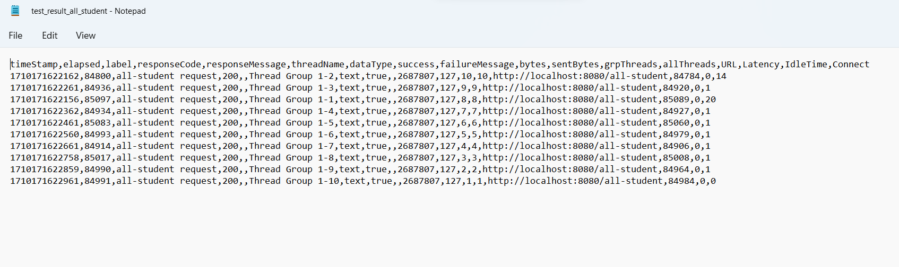
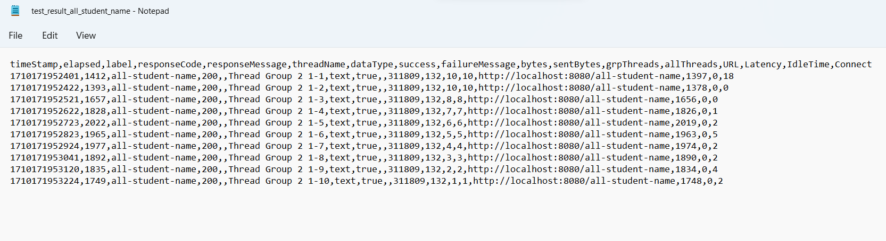
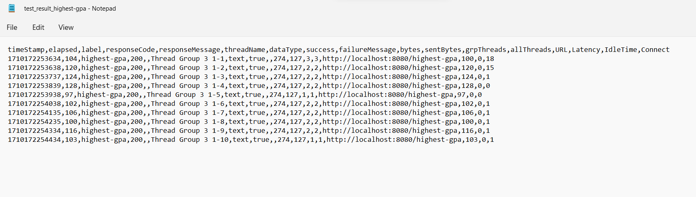

Screenshot tabel /all-student

screenshot tabel /all-student-name

screenshot tabel /highest-gpa

screenshot test result all student

screenshot test result all student name

screenshot test result highest gpa

<h2> Reflection module 5: </h2>

1. What is the difference between the approach of performance testing with JMeter and profiling with IntelliJ Profiler in the context of optimizing application performance?  
    - Jmeter: alat pengujian beban yang mengukur waktu respons server saat menerima banyak permintaan pengguna, dan membantu load testing aplikasi web.
    - Intellij: memberikan pandangan lebih detail tentang performa aplikasi, dan dapat membantu mengidentifikasi bug, bottleneck, dan mendiagnosis performa yang buruk.
2. How does the profiling process help you in identifying and understanding the weak points in your application?
    - dapat menunjukan flame tree, method list, dan timeline, dimana ada bagian kode dan runtimenya.
3. Do you think IntelliJ Profiler is effective in assisting you to analyze and identify bottlenecks in your application code?
    - iya, membantu dalam identifikasi masalah pada bottleneck performa, agar area-area tersebut dapat diidentifikasi dan dioptimisasi
4. What are the main challenges you face when conducting performance testing and profiling, and how do you overcome these challenges?
    - tantangan yang saya hadapi adalah mencari nama fungsinya karena memiliki nama yang beda dengan path yang diberi pada modul sehingga agak susah mencarinya karena juga harus membaca metode-metode yang ada, tantangan yang lain adalah mencari cara optimisasi kepada fungsi yang sudah O(n), yaitu highest-gpa
    - cara saya hadapi tantangan ini adalah dengan membaca fungsinya 1 per 1, dan coba-coba metode 1 per 1 dan lihat apakah terjadi improvement pada runtime
5. What are the main benefits you gain from using IntelliJ Profiler for profiling your application code?
    - dapat melihat runtime setiap fungsi sehingga mengetahui fungsi mana yang menyebabkan bottleneck dan dapat mengoptimisasi fungsi tersebut
6. How do you handle situations where the results from profiling with IntelliJ Profiler are not entirely consistent with findings from performance testing using JMeter?
    - Jmeter digunakan untuk menguji beban dan Intellij Profiling digunakan untuk melakukan analisis sehingga ketika terjadi berbedaan hasil, kita sebaiknya mengevaluasi ulang alat mana yang lebih cocok untuk digunakan dan menggunakan alat tersebut
7. What strategies do you implement in optimizing application code after analyzing results from performance testing and profiling? How do you ensure the changes you make do not affect the application's functionality?
    -  mengganti code dengan code lain yang melakukan fungsi yang sama dengan kompleksitas lebih rendah lalu melihat waktu fungsi pada profiling, jika waktu menurun maka optimisasi terjadi

    
 
<h3>Optimisasi yang dilakukan:</h3>  
getAllStudent: 5576ms ->660ms  
joinStudentName: 445ms -> 169ms  
highestGpa: 216ms -> 120ms  

